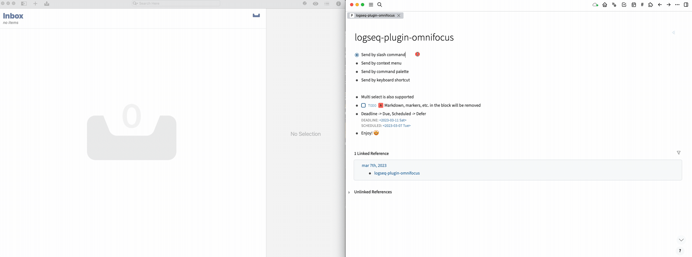

# Logseq OmniFocus Plugin

  
  
 A simple plugin for sending tasks from Logseq to <a href="https://www.omnigroup.com/omnifocus">OmniFocus</a>. 

## Effect
- Send selected blocks in Logseq to OmniFocus as tasks in Inbox
- Syntax symbols like markdown, Logseq markers, etc. will be cleaned before being sent to OmniFocus
- The first line of each block will be the name of the task
- The full content of the block will be the note of the task
- Deadline -> Due, Scheduled -> Defer
- A `logseq` tag is attached to the task
- A link pointing to the original block will be attached to the note

## Usage

- Slash command
  - Type `\Send to OmniFocus` to send the current block to OmniFocus
- Context Menu
  - Click the bullet at the right of the block to send it
- Command palette
  - Send the selected blocks to OmniFocus
  - `cmd+shift+p` to activate the command palette
  - Select `Send to OmniFocus`
- Keyboard Shortcut
  - `mod+ctrl+o` (default) to send the selected blocks to OmniFocus
  - You can change the default shortcut in Setting > Plugins > Logseq OmniFocus

## Install
Install the plugin in Logseq marketplace or download it from the release section.
To use the plugin, you must enable Automation in OmniFocus. You will be prompted when you launch this plugin for the first time. To avoid being prompted every time you send a task, please trust this script in OmniFocus. 
